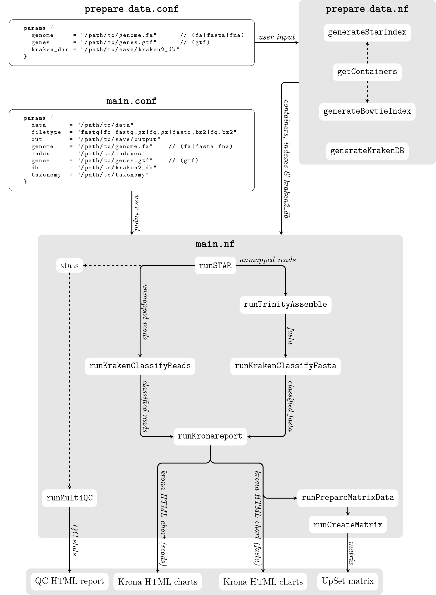

# nf-rnaSeqMetagen
*nf-rnaSeqMetagen* is a [Nextflow](http://nextflow.io/) 

<p align="center">
  
</p>

# 1. Pipeline Dependencies
To use the rnaSeqCount pipeline, the following dependencies are required:
### 1. _*Softwares*_
- [x] [Nextflow](https://www.nextflow.io/)
- [x] [Singularity](http://singularity.lbl.gov/)

### 1.2. _*Singularity Containers*_
- [x] [STAR](https://github.com/alexdobin/STAR)                       - ```shub://phelelani/nf-rnaSeqMetagen:star```
- [x] [Kraken](https://ccb.jhu.edu/software/kraken/)                  - ```shub://phelelani/nf-rnaSeqMetagen:kraken```
- [x] [Trinity](https://github.com/trinityrnaseq/trinityrnaseq/wiki)  - ```shub://phelelani/nf-rnaSeqMetagen:featurecounts```
- [x] [MultiQC](http://multiqc.info/)                                 - ```shub://phelelani/nf-rnaSeqMetagen:multiqc```

## 1.3. _*Reference Genome and Indexes*_
- [x] Reference Genome (.fa) and Genome Annotation (.gtf) files
- [x] Reference Genome Indexes (```bowtie2``` & ```STAR``` - see below on how to generate)

# 2. Optaining the ```nf-rnaSeqCount``` pipeline
The ```nf-rnaSeqMetagen``` pipeline can be obtain using any of the following methods:

### 2.1. Using the ```git``` command:
- [x] ```git clone https://github.com/phelelani/nf-rnaSeqMetagen.git```

### 2.2. Using the ```nextflow``` command:
- [x] ```nextflow pull phelelani/nf-rnaSeqMetagen```
- [x] ```nextflow pull https://github.com/phelelani/nf-rnaSeqMetagen.git```
- [x] ```nextflow clone phelelani/nf-rnaSeqMetagen <target-dir>```

# 3. Generating genome indexes.
To generate the ```STAR``` and ```bowtie2``` indexes for the reference genome, run the following commands:
### 3.1. ```STAR``` index
```
singularity exec --cleanenv containers/phelelani-rnaSeqCount-master-star.simg STAR --runThreadN 4 --runMode genomeGenerate --genomeDir <> --genomeFastaFiles <>
```

### 3.2. ```bowtie2``` index
```
singularity exec --cleanenv containers/phelelani-rnaSeqCount-master-star.simg bowtie2-build </path/to/genome.fa> </path/to/genome>
```

# 4. Pipeline Execution
The ```nf-rnaSeqCount``` pipeline can be run in one of two ways:

### 4.1. Directly from the command line by supplying the required parameters
```
nextflow run main.nf --data '/path/to/data' --out '/path/to/output' --genome '/path/to/genome.fa' --index '/path/to/STARIndex' --genes '/path/to/genes.gtf' --bind '/path/to/bind;/another/path/to/bind'
```

### 4.2 Edit main.nf:
```
params.data     = '/path/to/data'                       // Path to where the input data is located (where fastq files are located).
params.out      = '/path/to/output'                     // Path to where the output should be directed.
params.db       = '/path/to/kraken-db'                  // Path to where the Kraken database is installed.
params.taxonomy = '/path/to/taxonomy'                   // Path to where the taxonomy database is installed.
params.genome   = '/path/to/genome.fa'                  // The whole genome sequence (fasta | fa | fna).
params.index    = '/path/to/STARIndex'                  // Path to where the STAR index files are locaded.
params.bind     = '/path/to/bind;/another/path/to/bind' // Paths to be passed onto the singularity image (Semi-colon separated).

```

To run the pipeline:
```
nextflow run main.nf
```

# References
